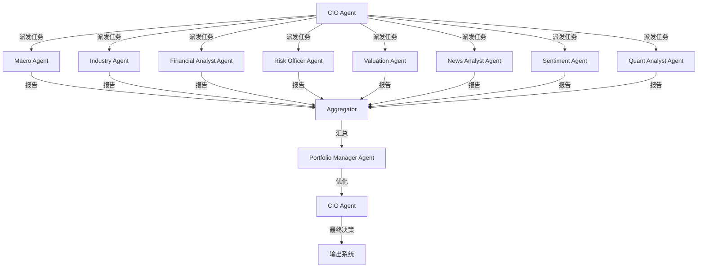

# 多Agent系统设计文档

## 1. Agent 角色定义

### 1.1 宏观研究员 (Macro Agent)

**职责**：全球宏观经济分析与监控

**输入**：
- GDP、CPI、PPI、PMI、失业率、利率等宏观指标
- 央行政策、财政政策、货币政策
- 全球贸易数据、汇率数据
- 地缘政治事件

**输出**：
- 国家风险评分 (0-100)
- 宏观状态：🟢 安全 / 🟡 注意 / 🟠 警惕 / 🔴 危险
- 1句话结论
- 关键指标异常列表

**核心逻辑**：
```python
class MacroAgent(BaseAgent):
    def analyze(self, country: str, indicators: dict) -> MacroReport:
        # 1. 计算衰退概率
        recession_prob = self._calculate_recession_probability(indicators)
        
        # 2. 计算流动性风险
        liquidity_risk = self._calculate_liquidity_risk(indicators)
        
        # 3. 计算通胀风险
        inflation_risk = self._calculate_inflation_risk(indicators)
        
        # 4. 综合评分
        risk_score = weighted_score([
            (recession_prob, 0.4),
            (liquidity_risk, 0.3),
            (inflation_risk, 0.2),
            (political_risk, 0.1)
        ])
        
        return MacroReport(
            country=country,
            risk_score=risk_score,
            status=self._risk_to_status(risk_score),
            conclusion=self._generate_conclusion(risk_score, indicators)
        )
```

### 1.2 行业研究员 (Industry Agent)

**职责**：行业景气度与竞争格局分析

**输入**：
- 行业营收、利润、增速数据
- 行业政策、监管动态
- 供需格局、价格走势
- 行业龙头财务数据

**输出**：
- 行业风险评分 (0-100)
- 行业景气度：🟢 繁荣 / 🟡 平稳 / 🟠 衰退 / 🔴 危机
- 龙头公司对比
- 1句话结论

### 1.3 财务分析师 (Financial Analyst Agent)

**职责**：企业财务深度分析

**输入**：
- 三大财务报表（利润表、资产负债表、现金流量表）
- 财务比率（PE、PB、ROE、ROIC、FCF Yield等）
- 行业对比数据

**输出**：
- 企业质量评分 Quality Score (0-100)
- 财务健康度：🟢 健康 / 🟡 一般 / 🟠 警惕 / 🔴 危险
- 关键财务异常列表

**评分维度**：
| 维度 | 权重 | 说明 |
|------|------|------|
| 盈利能力 | 20% | ROE、ROA、净利率、毛利率 |
| 成长能力 | 20% | 营收增速、利润增速、FCF增速 |
| 现金流质量 | 20% | 经营现金流/净利润、FCF持续性 |
| 资本效率 | 15% | ROIC、资产周转、存货周转 |
| 财务健康度 | 15% | 资产负债率、利息覆盖、流动比率 |
| 股东回报 | 10% | 分红率、回购、股东权益增长 |

### 1.4 风险控制官 (Risk Officer Agent)

**职责**：识别企业风险与财务造假

**输入**：
- 财务报表
- 审计报告
- 关联交易
- 股权质押
- 监管处罚
- 诉讼记录
- 管理层变动

**输出**：
- Risk Score (0-100)，分数越高风险越大
- 风险等级：🟢 安全 / 🟡 注意 / 🟠 警惕 / 🔴 危险
- 具体风险列表（含风险类型与风险等级）

**风险识别清单**：
- [ ] 财务造假风险（如：利润与现金流背离、应收账款异常增长）
- [ ] 退市风险（如：连续亏损、面值退市）
- [ ] 现金流断裂风险（如：经营现金流持续为负）
- [ ] 债务违约风险（如：利息覆盖倍数<1、短期债务占比过高）
- [ ] 商誉暴雷风险（如：商誉占净资产>50%）
- [ ] 诉讼风险
- [ ] 监管调查风险
- [ ] 管理层风险（如：频繁变动、质押比例过高）
- [ ] 关联交易风险
- [ ] 减持风险
- [ ] 股权质押风险（如：质押比例>50%）

### 1.5 估值分析师 (Valuation Agent)

**职责**：计算合理价值与低估幅度

**输入**：
- 财务数据
- 行业平均估值
- 历史估值区间
- 成长预期
- 风险评分

**输出**：
- 合理价值（Fair Value）
- 低估幅度（Undervaluation %）
- Value Score (0-100)
- 估值方法：DCF / 可比公司 / 历史分位

**估值规则**：
```python
class ValuationAgent(BaseAgent):
    def _value_screen(self, stock: Stock) -> bool:
        # 排除价值陷阱
        if stock.roe < industry_avg_roe * 0.5:
            return False  # 盈利能力太差
        if stock.debt_ratio > 0.7:
            return False  # 负债过高
        if stock.fcf_growth_5y < 0:
            return False  # FCF持续下降
        
        # 低估条件
        if stock.pe > industry_avg_pe * 0.7:
            return False  # PE不够低
        if stock.pb > industry_avg_pb * 0.7:
            return False  # PB不够低
        
        return True
    
    def calculate_value_score(self, stock: Stock) -> int:
        # 综合多个估值指标
        scores = []
        scores.append(self._pe_score(stock))
        scores.append(self._pb_score(stock))
        scores.append(self._fcf_yield_score(stock))
        scores.append(self._peg_score(stock))
        scores.append(self._ev_ebitda_score(stock))
        return min(100, int(sum(scores) / len(scores)))
```

### 1.6 新闻分析师 (News Analyst Agent)

**职责**：采集与解读新闻事件

**输入**：
- 官方公告、财报
- 电话会议纪要
- 投资者交流纪要
- 财经新闻（Bloomberg、Reuters、CNBC、财联社等）
- 交易所公告
- SEC/EDGAR 文件

**输出**：
- 事件分类（利好/利空/中性）
- 影响等级（极低/低/中/高/极高）
- 影响描述（1句话）
- 相关标的

### 1.7 舆情分析师 (Sentiment Agent)

**职责**：社交情绪分析

**输入**：
- Reddit、X(Twitter)
- 雪球、股吧
- Seeking Alpha
- Yahoo Finance 讨论区
- 社交媒体数据

**输出**：
- Sentiment Score (0-100，50为中性)
- 情绪等级：🟢 极度乐观 / 🟡 乐观 / ⬜ 中性 / 🟠 悲观 / 🔴 极度悲观
- 情绪关键词云
- 讨论热度趋势

### 1.8 量化分析师 (Quant Analyst Agent)

**职责**：技术指标与量化策略分析

**输入**：
- 价格数据、成交量数据
- 技术指标（MA、MACD、RSI、布林带等）
- 波动率数据
- 市场微观结构数据

**输出**：
- 技术信号（买入/卖出/观望）
- 波动率评估
- 动量评分
- 量价分析结论

### 1.9 组合经理 (Portfolio Manager Agent)

**职责**：组合优化与资产配置

**输入**：
- 所有Agent的分析报告
- 用户风险偏好
- 现有持仓
- 市场环境

**输出**：
- 推荐组合（AI推荐组合）
- 避险组合（AI避险组合）
- 配置建议（仓位、行业、地域）
- 调仓建议

### 1.10 首席投资官 (CIO Agent)

**职责**：最终决策汇总与输出

**输入**：
- 所有Agent的独立报告
- 组合经理建议

**输出**：
- 最终投资决策
- 统一输出格式（个股结论 + 宏观预警）
- 1句话原因
- 风险提示

**决策逻辑**：
```python
class CIOAgent(BaseAgent):
    def make_decision(self, reports: List[AgentReport]) -> InvestmentDecision:
        # 风险优先
        if any(r.risk_score > 80 for r in reports):
            return InvestmentDecision(action="SELL", reason="高风险信号")
        
        # 综合评分
        quality_score = reports["financial"].quality_score
        value_score = reports["valuation"].value_score
        risk_score = reports["risk"].risk_score
        
        # 综合决策
        composite_score = (quality_score * 0.3 + value_score * 0.3 - risk_score * 0.4)
        
        if composite_score > 70:
            action = "BUY"
        elif composite_score > 40:
            action = "WATCH"
        else:
            action = "SELL"
        
        return InvestmentDecision(
            action=action,
            composite_score=composite_score,
            reason=self._generate_reason(reports)
        )
```

## 2. Agent 协作协议

### 2.1 消息格式

```json
{
  "message_id": "uuid",
  "timestamp": "2025-01-20T10:00:00Z",
  "from_agent": "macro_agent",
  "to_agent": "cio_agent",
  "type": "ANALYSIS_REPORT",
  "payload": {
    "stock_code": "MSFT",
    "market": "US",
    "report_type": "MACRO",
    "risk_score": 82,
    "status": "HIGH_RISK",
    "conclusion": "美国经济处于高风险状态",
    "details": {},
    "confidence": 0.92
  },
  "meta": {
    "data_sources": ["BLS", "Fed", "Treasury"],
    "data_timestamp": "2025-01-20T09:30:00Z"
  }
}
```

### 2.2 工作流



## 3. Agent 状态管理

使用 LangGraph 状态机管理Agent工作流：

```python
from langgraph.graph import StateGraph, END

class AgentState:
    """全局Agent状态"""
    stock_code: str
    market: str
    reports: Dict[str, AgentReport]
    final_decision: Optional[InvestmentDecision]
    error: Optional[str]

# 定义工作流
workflow = StateGraph(AgentState)

# 添加节点
workflow.add_node("dispatch", dispatch_agents)
workflow.add_node("macro", macro_agent.run)
workflow.add_node("industry", industry_agent.run)
workflow.add_node("financial", financial_agent.run)
workflow.add_node("risk", risk_agent.run)
workflow.add_node("valuation", valuation_agent.run)
workflow.add_node("news", news_agent.run)
workflow.add_node("sentiment", sentiment_agent.run)
workflow.add_node("quant", quant_agent.run)
workflow.add_node("aggregate", aggregate_reports)
workflow.add_node("portfolio", portfolio_agent.optimize)
workflow.add_node("cio", cio_agent.decide)

# 定义边（并行执行）
workflow.add_edge("dispatch", ["macro", "industry", "financial", "risk", "valuation", "news", "sentiment", "quant"])
workflow.add_edge(["macro", "industry", "financial", "risk", "valuation", "news", "sentiment", "quant"], "aggregate")
workflow.add_edge("aggregate", "portfolio")
workflow.add_edge("portfolio", "cio")
workflow.add_edge("cio", END)

# 编译
app = workflow.compile()
```

## 4. 配置参数

每个Agent的配置参数化，支持热更新：

```yaml
# config/agents.yaml
agents:
  macro_agent:
    enabled: true
    weight: 0.15
    indicators:
      - gdp
      - cpi
      - unemployment
      - yield_curve
    risk_thresholds:
      low: 30
      medium: 60
      high: 80

  financial_agent:
    enabled: true
    weight: 0.25
    scoring_weights:
      profitability: 0.20
      growth: 0.20
      cashflow: 0.20
      efficiency: 0.15
      health: 0.15
      shareholder: 0.10

  risk_agent:
    enabled: true
    weight: 0.30
    risk_checks:
      - fraud_risk
      - delisting_risk
      - cashflow_risk
      - default_risk
      - goodwill_risk
      - litigation_risk
      - regulatory_risk
      - management_risk
      - related_party_risk
      - reduction_risk
      - pledge_risk

  valuation_agent:
    enabled: true
    weight: 0.20
    methods:
      - dcf
      - comparable
      - historical_percentile
    value_thresholds:
      undervalued: 0.30
      fair: 0.10
      overvalued: -0.10

  cio_agent:
    decision_rules:
      risk_first: true
      composite_formula: "quality*0.3 + value*0.3 - risk*0.4"
      thresholds:
        buy: 70
        watch: 40
        sell: 0
```